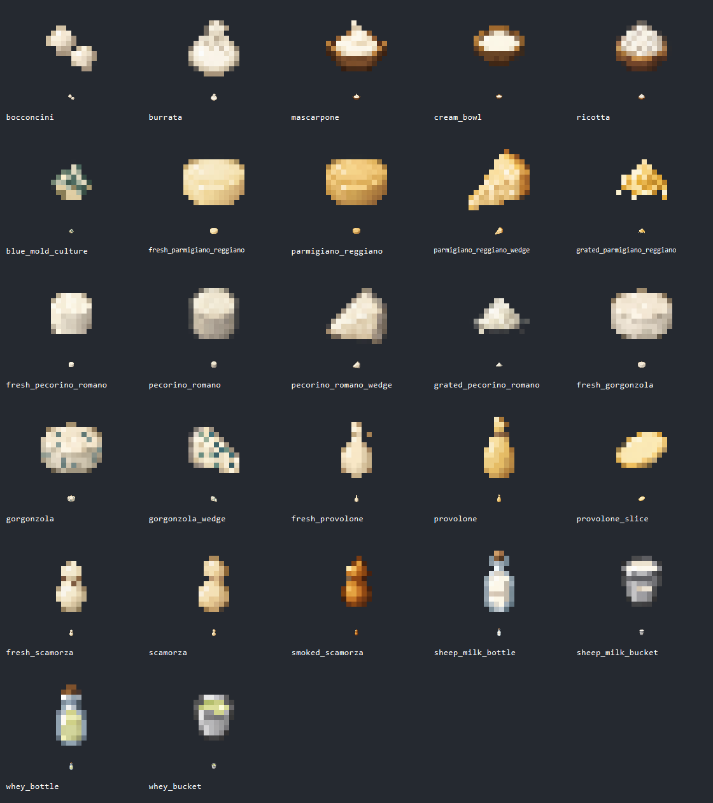

# Italian's Delight — Checklist texture formaggi

Documento di riferimento per creare le texture degli item registrati nel branch
`feature/cheeses`.

## Regole comuni

Tutte le texture elencate qui sono sprite item Minecraft **16×16 px**.

Percorso base:

`src/main/resources/assets/italiansdelight/textures/item/`

Il nome del PNG deve coincidere esattamente con l'ID indicato nella tabella.
I file `assets/italiansdelight/items/*.json` e
`assets/italiansdelight/models/item/*.json` sono già presenti e puntano alle
texture indicate. Le 27 texture realizzate in precedenza restano presenti;
i nuovi item `scamorza_slice`, `smoked_scamorza_slice` e
`apple_cider_vinegar` non hanno ancora un PNG e mostrano quindi la normale
missing texture di Minecraft.

Convenzioni dei nomi:

- `fresh_` = forma fresca/intermedia, prima di stagionatura o asciugatura;
- nome senza `fresh_` = prodotto finale/stagionato;
- `_wedge` = **spicchio** di una forma intera;
- `_slice` = fetta;
- `grated_` = formaggio grattugiato;
- `smoked_` = variante affumicata.

## Texture dei formaggi create

| ID item | Nome visualizzato IT | Significato grafico | File PNG |
|---|---|---|---|
| `bocconcini` | Bocconcini | Piccole mozzarelle/formaggi freschi singoli | `bocconcini.png` |
| `fresh_parmigiano_reggiano` | Forma Fresca di Parmigiano Reggiano | Forma appena prodotta, prima della stagionatura | `fresh_parmigiano_reggiano.png` |
| `parmigiano_reggiano` | Forma di Parmigiano Reggiano | Forma intera stagionata | `parmigiano_reggiano.png` |
| `parmigiano_reggiano_wedge` | Spicchio di Parmigiano Reggiano | Spicchio/cuneo ricavato dalla forma | `parmigiano_reggiano_wedge.png` |
| `grated_parmigiano_reggiano` | Parmigiano Reggiano Grattugiato | Porzione di formaggio grattugiato | `grated_parmigiano_reggiano.png` |
| `fresh_pecorino_romano` | Forma Fresca di Pecorino Romano | Forma appena prodotta, prima della stagionatura | `fresh_pecorino_romano.png` |
| `pecorino_romano` | Forma di Pecorino Romano | Forma intera stagionata | `pecorino_romano.png` |
| `pecorino_romano_wedge` | Spicchio di Pecorino Romano | Spicchio/cuneo ricavato dalla forma | `pecorino_romano_wedge.png` |
| `grated_pecorino_romano` | Pecorino Romano Grattugiato | Porzione di formaggio grattugiato | `grated_pecorino_romano.png` |
| `fresh_gorgonzola` | Forma Fresca di Gorgonzola | Forma prima della maturazione/erborinatura finale | `fresh_gorgonzola.png` |
| `gorgonzola` | Forma di Gorgonzola | Forma intera maturata | `gorgonzola.png` |
| `gorgonzola_wedge` | Spicchio di Gorgonzola | Spicchio/cuneo ricavato dalla forma | `gorgonzola_wedge.png` |
| `fresh_provolone` | Provolone Fresco | Forma prima della stagionatura | `fresh_provolone.png` |
| `provolone` | Provolone | Forma intera stagionata | `provolone.png` |
| `provolone_slice` | Fetta di Provolone | Fetta sottile ricavata dal Provolone | `provolone_slice.png` |
| `fresh_scamorza` | Scamorza Fresca | Scamorza appena formata, prima dell'asciugatura | `fresh_scamorza.png` |
| `scamorza` | Scamorza | Scamorza asciugata/pronta | `scamorza.png` |
| `smoked_scamorza` | Scamorza Affumicata | Variante affumicata della Scamorza | `smoked_scamorza.png` |
| `scamorza_slice` | Fetta di Scamorza | Quarto di una Scamorza | `scamorza_slice.png` |
| `smoked_scamorza_slice` | Fetta di Scamorza Affumicata | Quarto della variante affumicata | `smoked_scamorza_slice.png` |
| `burrata` | Burrata | Burrata pronta al consumo | `burrata.png` |
| `mascarpone` | Mascarpone | Mascarpone servito nel suo contenitore/ciotola | `mascarpone.png` |

## Texture degli ingredienti e degli altri prodotti create

Il controllo dei modelli item ha individuato anche queste sette texture
mancanti, comprese nella stessa lavorazione grafica.

| ID item | Nome visualizzato IT | Significato grafico | File PNG |
|---|---|---|---|
| `ricotta` | Ricotta | Ciotola con ricotta bianca dalla consistenza granulosa | `ricotta.png` |
| `cream_bowl` | Panna | Ciotola con superficie liquida, liscia e chiara | `cream_bowl.png` |
| `blue_mold_culture` | Coltura Erborinata | Piccolo grumo con zone blu-verdi, senza contenitore | `blue_mold_culture.png` |
| `sheep_milk_bottle` | Bottiglia di Latte di Pecora | Bottiglia con latte bianco e piccolo richiamo alla lana | `sheep_milk_bottle.png` |
| `sheep_milk_bucket` | Secchio di Latte di Pecora | Secchio metallico con latte bianco e piccolo richiamo alla lana | `sheep_milk_bucket.png` |
| `whey_bottle` | Bottiglia di Siero di Latte | Bottiglia con liquido giallo paglierino | `whey_bottle.png` |
| `whey_bucket` | Secchio di Siero di Latte | Secchio metallico con liquido giallo paglierino | `whey_bucket.png` |

## Texture non ancora create

| ID item | Nome visualizzato IT | File atteso | Motivo |
|---|---|---|---|
| `scamorza_slice` | Fetta di Scamorza | `scamorza_slice.png` | Nuovo item aggiunto dopo il primo lotto di texture. |
| `smoked_scamorza_slice` | Fetta di Scamorza Affumicata | `smoked_scamorza_slice.png` | Nuovo item aggiunto dopo il primo lotto di texture. |
| `apple_cider_vinegar` | Bottiglia di Aceto di Mele | `apple_cider_vinegar.png` | La texture appartiene al futuro branch vino/barile. |

Non vengono creati PNG placeholder: finché questi file mancano Minecraft usa
la propria missing texture.

## Distinzioni visive

- Parmigiano: forma bassa e larga, più dorata dopo la stagionatura.
- Pecorino: forma più alta, pasta chiara e crosta grigio-beige nel prodotto maturo.
- Gorgonzola: forma chiara; macchie e venature blu-verdi nella variante matura.
- Provolone: forma allungata; la porzione è una fetta ovale sottile.
- Scamorza: testa e pancia separate dal collo legato; colore ambrato per l'affumicata.
- Burrata: sacca tondeggiante con chiusura superiore; bocconcini più piccoli e separati.
- Panna, Ricotta e Mascarpone: ciotole distinguibili per contenuto liquido,
  granuloso o cremoso con una piega superiore.
- Latte di pecora bianco e siero paglierino distinguono i due liquidi.

## Nota su `wedge`

`wedge` significa **spicchio**: una porzione a cuneo/triangolare ricavata da
una forma intera. È il suffisso definitivo per Parmigiano Reggiano, Pecorino
Romano e Gorgonzola.

Per il Provolone si usa invece `slice`, perché la porzione prevista è una
fetta e non uno spicchio.

## Stato

Registrazione item, traduzioni, creative tab e file item/model: **completati**.

Texture PNG: **27 create, 3 ancora da creare**.

Verifiche eseguite:

- le 27 texture già realizzate hanno dimensioni 16×16, canale alpha e
  contenuto visibile;
- i 27 sprite già realizzati sono distinti; i tre nuovi modelli puntano
  intenzionalmente a texture ancora mancanti;
- controllo visivo della tavola a scala originale e ingrandita;
- build Gradle offline completata con successo.

La verifica visiva nel client Minecraft resta da effettuare: controllare
inventario, creative tab e JEI, soprattutto le differenze fra forme fresche e
stagionate e fra i contenitori dei due liquidi.

## Anteprima e generazione

[Apri la tavola completa](images/texture_formaggi.png): ogni voce mostra lo
sprite ingrandito 8× e sotto la versione originale 16×16.

Texture generate con lo strumento integrato **imagegen**, una per item.
Il [set completo dei prompt](TEXTURE_FORMAGGI_PROMPTS.json) comprende le
indicazioni comuni, i soggetti e le rifiniture selezionate per Parmigiano e
Gorgonzola. L'esportazione tecnica usa campionamento nearest-neighbor,
mantiene proporzioni e alpha e aggiunge margini trasparenti al formato
quadrato; per le bottiglie è stato ridotto il margine vuoto dell'originale.

La progettazione della stagionatura verrà affrontata nella fase successiva e
non richiede di rinominare questi item.

## Texture animata del siero

Il liquido nel tank della caldaia e in JEI usa ora una texture dedicata con
32 fotogrammi 16×16. Specifiche, riferimenti, prompt e anteprima animata sono
in [`TEXTURE_SIERO.md`](TEXTURE_SIERO.md).
