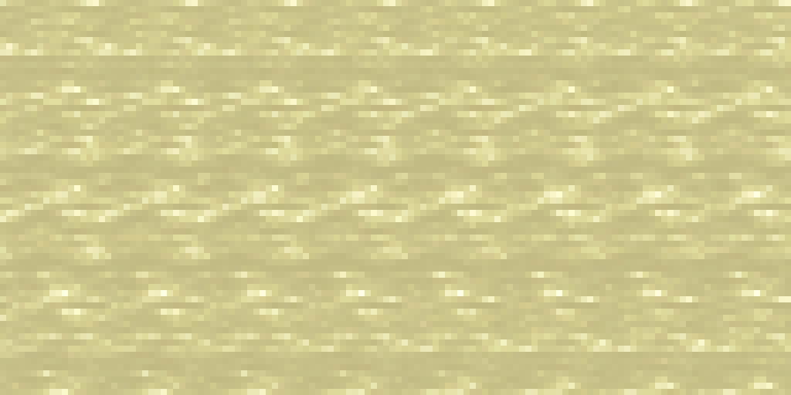

# Siero animato della Cheese Vat

Il tank della caldaia e quello delle ricette JEI usano la stessa texture
animata, color giallo paglierino con leggere sfumature crema e verde.

[Apri l'anteprima animata nel browser](SIERO_ANIMATO.html): il cursore permette
di provare da 0 a 4000 mB e il pulsante mette in pausa l'animazione. Il file
incorpora le immagini e funziona anche offline.

## Risorse

- Texture: `src/main/resources/assets/italiansdelight/textures/block/fluids/whey_still.png`.
- Animazione e ripetizione: `whey_still.png.mcmeta`, nella stessa cartella.
- Registrazione nell'atlante GUI: `src/main/resources/assets/minecraft/atlases/gui.json`.
- Renderer condiviso: `src/main/java/dev/italiansdelight/client/gui/WheyTankRenderer.java`.

Il PNG è una striscia **16×512**, composta da **32 fotogrammi 16×16**.
Ogni fotogramma dura **2 tick**; il ciclo completo dura **64 tick / 3,2 secondi**.
L'interpolazione fra fotogrammi rende il movimento più graduale.

La texture si ripete alla scala originale nel tank 16×32 e viene ritagliata
dal basso in base al riempimento. Il motivo rimane ancorato alla stessa
posizione quando cambia la quantità; una linea chiara di un pixel identifica
la superficie. Restano validi **250 mB = 2 pixel** e la capacità di **4000 mB**.
Il tank vuoto non disegna liquido.

L'atlante GUI di Minecraft gestisce l'avanzamento dell'animazione e il
ricaricamento delle risorse. Non serve un contatore dedicato nella schermata.
Lo sprite è registrato come `italiansdelight:fluids/whey_still`, con scala
`tile` 16×16. La risorsa nella cartella `block/fluids` rimane disponibile per
il futuro lavoro sul calderone; questa modifica riguarda il tank della GUI
e la sua rappresentazione in JEI.

## Riferimenti e generazione

Il riferimento locale è `textures/block/fluids/olive_oil_still.png`, con i suoi
32 fotogrammi e `frametime: 2`. È stato disposto temporaneamente su una griglia
8×4, ricolorato con lo strumento integrato **imagegen**, quindi esportato con
campionamento nearest-neighbor e ricomposto nella striscia verticale finale.
Il [prompt completo](TEXTURE_SIERO_PROMPT.json) è conservato separatamente.

Riferimenti tecnici consultati online:

- [Mekanism — GuiFluidGauge](https://github.com/mekanism/Mekanism/blob/1.21.x/src/main/java/mekanism/client/gui/element/gauge/GuiFluidGauge.java)
  recupera la texture `STILL` del fluido.
- [Mekanism — GuiGauge](https://github.com/mekanism/Mekanism/blob/1.21.x/src/main/java/mekanism/client/gui/element/gauge/GuiGauge.java)
  la ripete nell'indicatore usando il livello di riempimento.
- [Create — FluidTankRenderer](https://github.com/Creators-of-Create/Create/blob/mc1.21.1/dev/src/main/java/com/simibubi/create/content/fluids/tank/FluidTankRenderer.java)
  dimensiona il volume disegnato in base al livello del tank.

Le API di disegno usate qui sono quelle di Minecraft **26.2**, verificate
nel JAR locale del progetto.

## Verifiche

- PNG valido: 16×512, 32 fotogrammi distinti e completamente opachi.
- Metadata di animazione e collegamento dell'atlante GUI verificati.
- Passaggio 31→0 confrontato con gli altri: variazione RGB media 1,91/255,
  rispetto alla media di 1,80/255 sull'intero ciclo.
- Build Gradle offline completata con successo.

Da provare nel client Minecraft:

- tank vuoto, 250, 500, 2000 e 4000 mB: livello corretto e liquido contenuto
  all'interno della cornice;
- movimento visibile anche senza calore e con il flow del tank disabilitato;
- estrazione e produzione: cambia il livello, senza stirare la texture;
- ricetta della Ricotta in JEI: stesso siero animato e tooltip del requisito;
- cambio della scala GUI e ricaricamento delle risorse con F3+T.

L'anteprima HTML riproduce le risorse e il disegno del tank, ma non sostituisce
la verifica della schermata nel client Minecraft.
